# Diagrammes de Classe UML Complets - EasySave

Ce document contient les diagrammes de classe UML détaillés du projet EasySave avec toutes les informations complètes.

---

## Table des Matières

1. [Modèles (Models)](#1-modèles-models)
2. [Exceptions](#2-exceptions)
3. [Services de Copie de Fichiers](#3-services-de-copie-de-fichiers)
4. [Utilitaires](#4-utilitaires)
5. [Infrastructure](#5-infrastructure)
6. [Stratégies de Backup](#6-stratégies-de-backup)
7. [Service de Backup](#7-service-de-backup)
8. [Services d'Application](#8-services-dapplication)
9. [Pattern Command - Menu](#9-pattern-command---menu)
10. [Pattern Stratégie - Sélection](#10-pattern-stratégie---sélection)
11. [ViewModel Principal](#11-viewmodel-principal)
12. [Point d'Entrée](#12-point-dentrée)
13. [Vue Globale](#13-vue-globale)

---

## 1. Modèles (Models)

### 1.1 Shared.Models.BackupJob

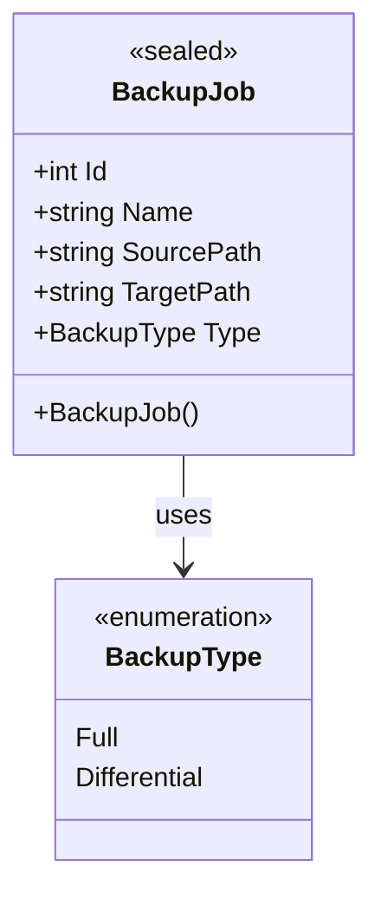

### 1.2 Shared.Models.BackupResult

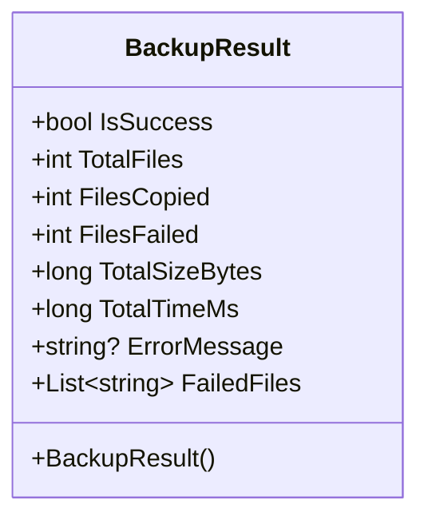

### 1.3 Shared.Models.BackupProgress

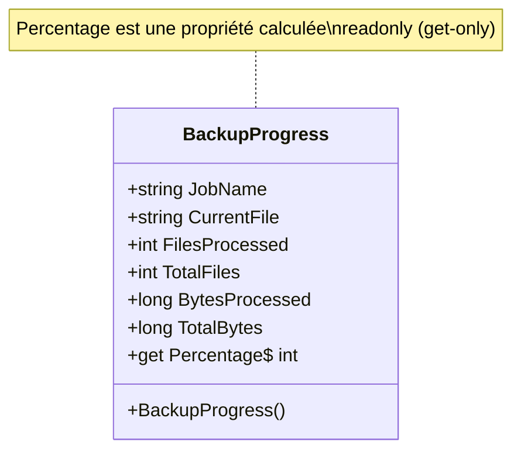

### 1.4 Core.Models.FileMetadata

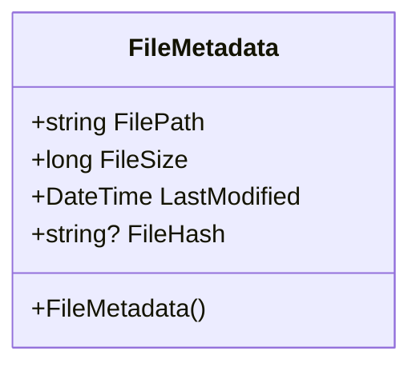

### 1.5 App.Models.AppSettings

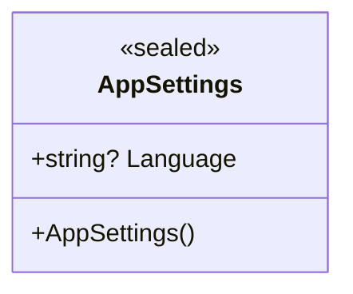

---

## 2. Exceptions

### 2.1 Core.Exceptions.BackupException

```mermaid
classDiagram
    class BackupException {
        +string? SourcePath
        +string? TargetPath
        +BackupErrorType ErrorType
        +BackupException()
        +BackupException(message: string)
        +BackupException(message: string, errorType: BackupErrorType)
        +BackupException(message: string, errorType: BackupErrorType, sourcePath: string?, targetPath: string?, innerException: Exception?)
    }

    Class BackupErrorType {
        <<enumeration>>
        SourceAccess
        TargetAccess
        CopyFailed
        FileLocked
        InsufficientSpace
        NetworkError
        Unknown
    }

    Exception <|-- BackupException : extends
    BackupException --> BackupErrorType : contains

    note for BackupException "Exception personnalisée pour les erreurs de backup\navec informations de chemin et type d'erreur"
```

---

## 3. Services de Copie de Fichiers

### 3.1 Core.Services.IFileCopier

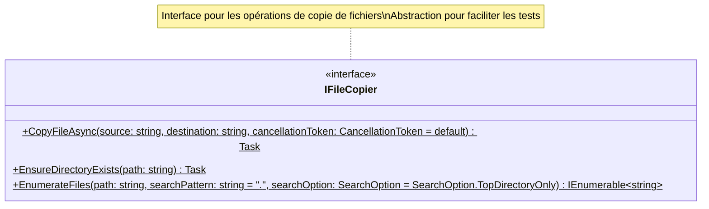

### 3.2 Core.Services.FileCopier

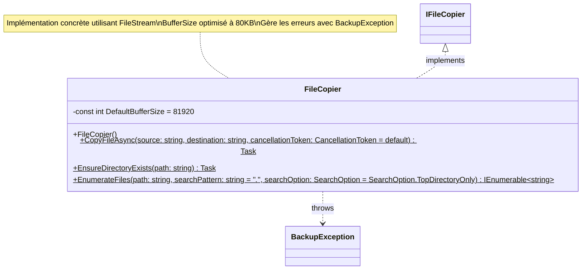

---

## 4. Utilitaires

### 4.1 Core.Utilities.FileComparer

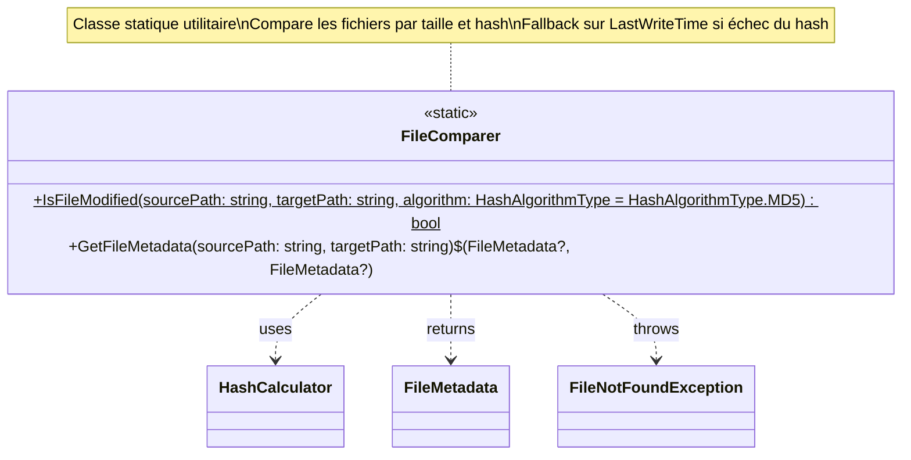

---

## 5. Infrastructure

### 5.1 Infrastructure.HashCalculator

```mermaid
classDiagram
    class HashCalculator {
        <<static>>
        +ComputeMD5(filePath: string)$ string
        +ComputeSHA256(filePath: string)$ string
        +ComputeHash(filePath: string, algorithm: HashAlgorithmType)$ string
    }

    Class HashAlgorithmType {
        <<enumeration>>
        MD5
        SHA256
    }

    HashCalculator ..> HashAlgorithmType : uses
    HashCalculator ..> FileNotFoundException : throws
    HashCalculator ..> IOException : throws
    HashCalculator ..> ArgumentOutOfRangeException : throws

    note for HashCalculator "Classe statique pour le calcul de hash\nSupporte MD5 et SHA256\nRetourne hash hexadécimal en minuscules"
```

### 5.2 Infrastructure.ILoggingService & LoggingService

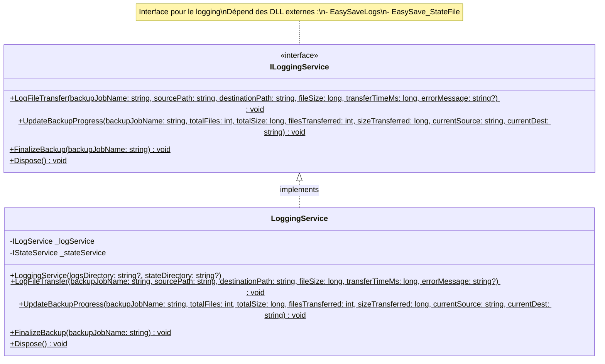

---

## 6. Stratégies de Backup

### 6.1 Core.Strategies.IBackupStrategy

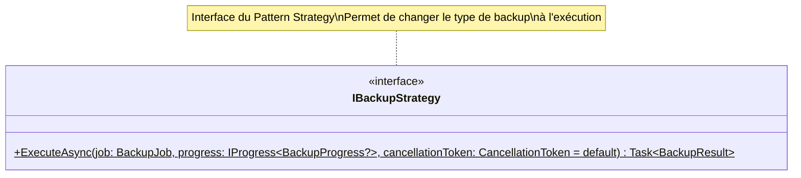

### 6.2 Core.Strategies.FullBackupStrategy

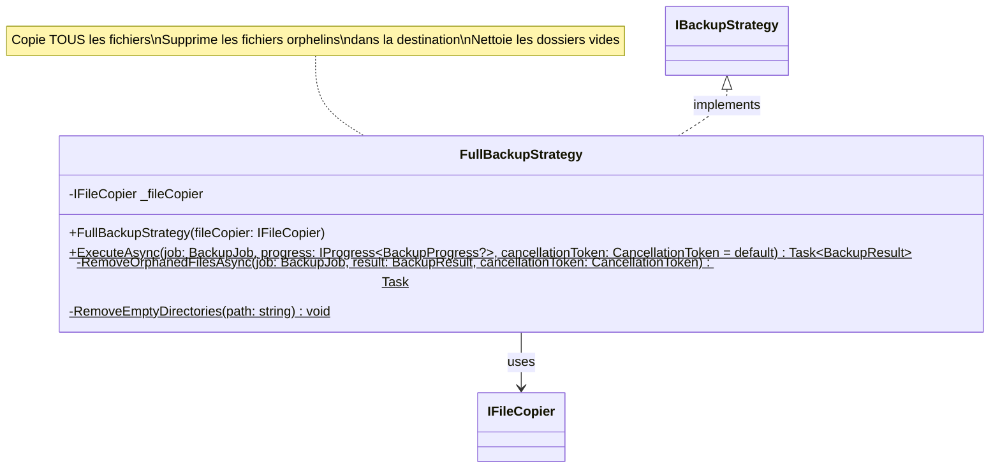

### 6.3 Core.Strategies.DifferentialBackupStrategy

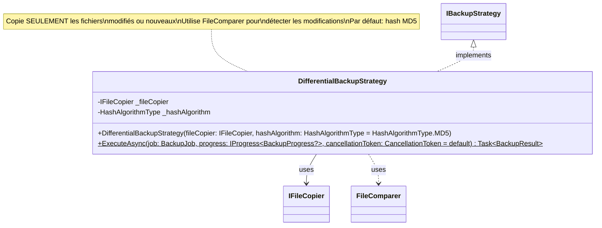

---

## 7. Service de Backup

### 7.1 Core.Services.IBackupService

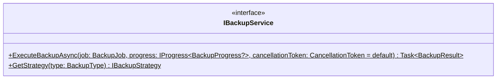

### 7.2 Core.Services.BackupService

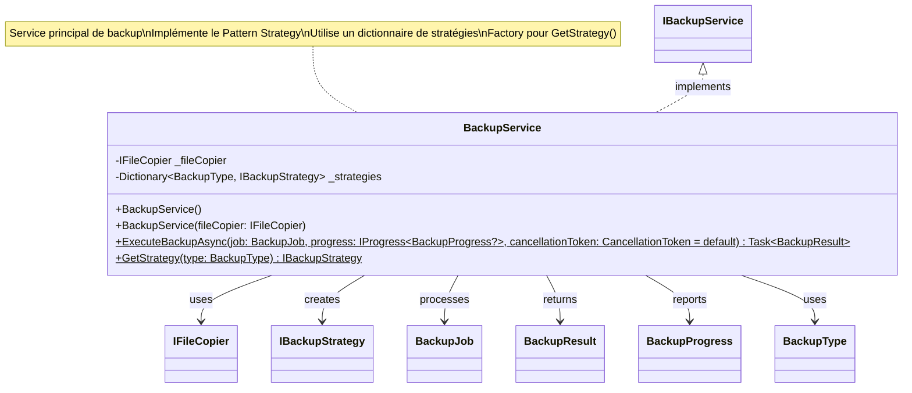

---

## 8. Services d'Application

### 8.1 Services.AppPaths

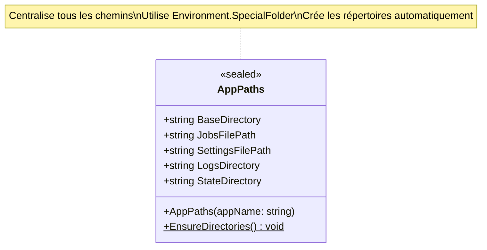

### 8.2 Services.JsonRepository

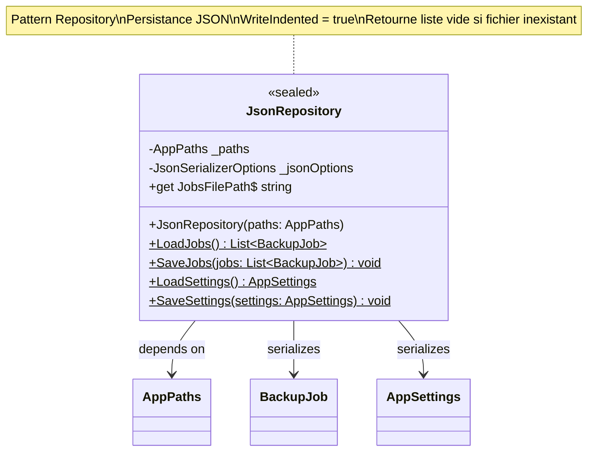

### 8.3 Services.LocalizationService

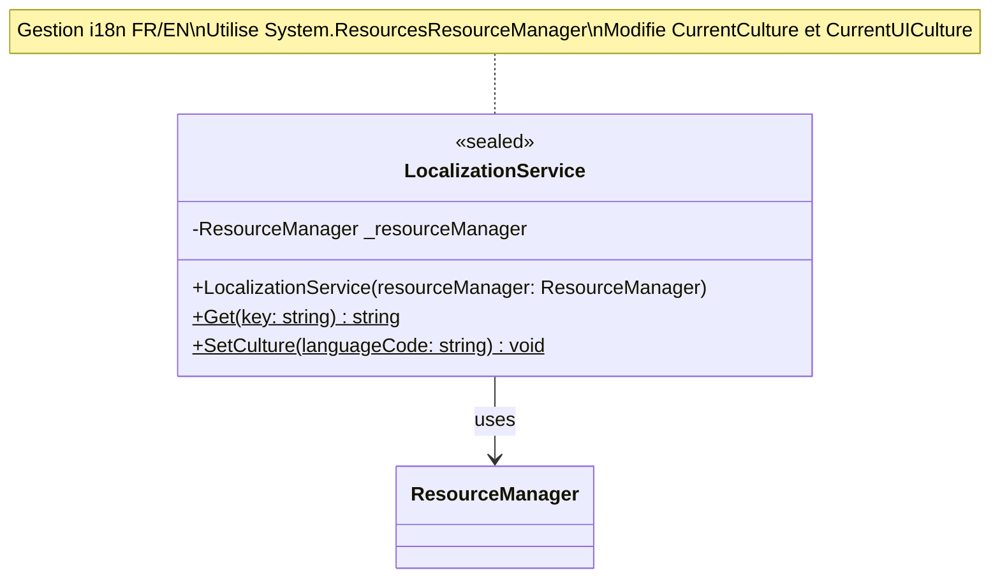

### 8.4 Services.ConsoleUi

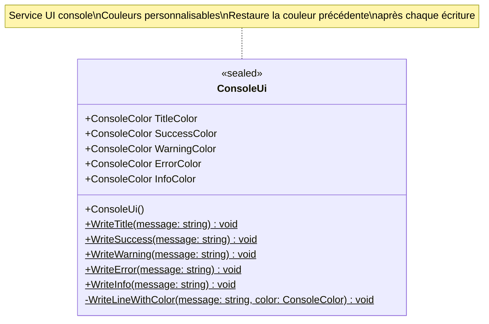

### 8.5 Services.JobValidator

```mermaid
classDiagram
    class JobValidator {
        <<sealed>>
        +JobValidator()
        +Validate(job: BackupJob)$ ValidationResult
    }

    JobValidator --> BackupJob : validates
    JobValidator --> ValidationResult : returns

    note for JobValidator "Validateur de BackupJob\nVérifie : nom, chemins, existence\ndossiers, source != cible"
```

### 8.6 Services.ValidationResult

```mermaid
classDiagram
    class ValidationResult {
        <<sealed>>
        +IReadOnlyList~string~ ErrorKeys
        +get IsValid$ bool
        +ValidationResult(errorKeys: IEnumerable~string~)
    }

    note for ValidationResult "Résultat de validation\nIsValid = true si pas d'erreurs\nListe de clés de localisation"
```

---

## 9. Pattern Command - Menu

### 9.1 Services.IMenuCommand

```mermaid
classDiagram
    class IMenuCommand {
        <<interface>>
        +get Key$ string
        +get LabelKey$ string
        +Execute()$ void
    }

    note for IMenuCommand "Interface du Pattern Command\nKey = touche/clé de sélection\nLabelKey = clé de localisation\nExecute() = action à exécuter"
```

### 9.2 Services.MenuCommandBase

```mermaid
classDiagram
    class MenuCommandBase {
        <<abstract>>
        +get Key$ string
        +get LabelKey$ string
        +Execute()$ void*
    }

    IMenuCommand <|.. MenuCommandBase : implements

    note for MenuCommandBase "Classe de base abstraite\npour toutes les commandes de menu"
```

### 9.3 Commandes Concrètes

```mermaid
classDiagram
    class ExitCommand {
        <<sealed>>
        -Action _exitAction
        +ExitCommand(exitAction: Action)
        +get Key$ string = "0"
        +get LabelKey$ string = "MenuExit"
        +Execute()$ void
    }

    class CreateJobCommand {
        <<sealed>>
        -ConsoleMenuViewModel _viewModel
        +CreateJobCommand(viewModel: ConsoleMenuViewModel)
        +get Key$ string = "1"
        +get LabelKey$ string = "MenuCreate"
        +Execute()$ void
    }

    class ListJobsCommand {
        <<sealed>>
        -ConsoleMenuViewModel _viewModel
        +ListJobsCommand(viewModel: ConsoleMenuViewModel)
        +get Key$ string = "2"
        +get LabelKey$ string = "MenuList"
        +Execute()$ void
    }

    class RunJobsCommand {
        <<sealed>>
        -ConsoleMenuViewModel _viewModel
        +RunJobsCommand(viewModel: ConsoleMenuViewModel)
        +get Key$ string = "3"
        +get LabelKey$ string = "MenuRun"
        +Execute()$ void
    }

    class ChangeLanguageCommand {
        <<sealed>>
        -ConsoleMenuViewModel _viewModel
        +ChangeLanguageCommand(viewModel: ConsoleMenuViewModel)
        +get Key$ string = "4"
        +get LabelKey$ string = "MenuLanguage"
        +Execute()$ void
    }

    class ShowConfigPathCommand {
        <<sealed>>
        -ConsoleMenuViewModel _viewModel
        +ShowConfigPathCommand(viewModel: ConsoleMenuViewModel)
        +get Key$ string = "5"
        +get LabelKey$ string = "MenuConfigPath"
        +Execute()$ void
    }

    MenuCommandBase <|-- ExitCommand : extends
    MenuCommandBase <|-- CreateJobCommand : extends
    MenuCommandBase <|-- ListJobsCommand : extends
    MenuCommandBase <|-- RunJobsCommand : extends
    MenuCommandBase <|-- ChangeLanguageCommand : extends
    MenuCommandBase <|-- ShowConfigPathCommand : extends

    ExitCommand --> ConsoleMenuViewModel : delegates
    CreateJobCommand --> ConsoleMenuViewModel : delegates
    ListJobsCommand --> ConsoleMenuViewModel : delegates
    RunJobsCommand --> ConsoleMenuViewModel : delegates
    ChangeLanguageCommand --> ConsoleMenuViewModel : delegates
    ShowConfigPathCommand --> ConsoleMenuViewModel : delegates
```

---

## 10. Pattern Stratégie - Sélection

### 10.1 Services.ISelectionStrategy

```mermaid
classDiagram
    class ISelectionStrategy {
        <<interface>>
        +GetSelectedIndices(selection: string, max: int)$ List~int~
    }

    note for ISelectionStrategy "Interface du Pattern Strategy\nPour la sélection de jobs\nFormat: liste (1;3;5) ou plage (1-3)"
```

### 10.2 Services.ListSelectionStrategy

```mermaid
classDiagram
    class ListSelectionStrategy {
        <<sealed>>
        +GetSelectedIndices(selection: string, max: int)$ List~int~
    }

    ISelectionStrategy <|.. ListSelectionStrategy : implements

    note for ListSelectionStrategy "Parse le format liste\nEx: \"1;3;5\" -> [1, 3, 5]\nDédoublonne et trie les résultats"
```

### 10.3 Services.RangeSelectionStrategy

```mermaid
classDiagram
    class RangeSelectionStrategy {
        <<sealed>>
        +GetSelectedIndices(selection: string, max: int)$ List~int~
    }

    ISelectionStrategy <|.. RangeSelectionStrategy : implements

    note for RangeSelectionStrategy "Parse le format plage\nEx: \"1-3\" -> [1, 2, 3]\nGère les plages inversées \"3-1\""
```

### 10.4 Services.SelectionStrategyResolver

```mermaid
classDiagram
    class SelectionStrategyResolver {
        <<sealed>>
        -ISelectionStrategy _rangeStrategy
        -ISelectionStrategy _listStrategy
        +SelectionStrategyResolver(rangeStrategy: ISelectionStrategy, listStrategy: ISelectionStrategy)
        +Resolve(selection: string, max: int)$ List~int~
    }

    SelectionStrategyResolver --> ISelectionStrategy : uses

    note for SelectionStrategyResolver "Factory/Resolver de stratégie\nDétecte le format '-' pour plage\nSinon utilise liste par défaut"
```

---

## 11. ViewModel Principal

### 11.1 ViewModels.ConsoleMenuViewModel

```mermaid
classDiagram
    class ConsoleMenuViewModel {
        <<sealed>>
        -const int MaxJobs = 7
        -JsonRepository _repository
        -LocalizationService _localization
        -IBackupService _backupService
        -JobValidator _validator
        -ConsoleUi _ui
        -SelectionStrategyResolver _selectionResolver
        -Dictionary~string, IMenuCommand~ _commands
        +ConsoleMenuViewModel(repository: JsonRepository, localization: LocalizationService, backupService: IBackupService, validator: JobValidator, ui: ConsoleUi, selectionResolver: SelectionStrategyResolver, loggingService: ILoggingService)
        +ShowMenu()$ void
        +RunJobsFromArgs(selection: string)$ void
        +CreateJob()$ void
        +ListJobs()$ void
        +RunJobsInteractive()$ void
        +ChangeLanguage()$ void
        +ShowConfigPath()$ void
        -BuildCommands()$ Dictionary~string, IMenuCommand~
        -ShowSelectionSummary(jobs: List~BackupJob~)$ void
        -ConfirmExecution()$ bool
        -ExecuteJob(job: BackupJob, loggingService: LoggingService)$ void
        -ExecuteJob(job: BackupJob)$ void
        -ReadRequired()$ string
    }

    ConsoleMenuViewModel --> JsonRepository : uses
    ConsoleMenuViewModel --> LocalizationService : uses
    ConsoleMenuViewModel --> IBackupService : uses
    ConsoleMenuViewModel --> JobValidator : uses
    ConsoleMenuViewModel --> ConsoleUi : uses
    ConsoleMenuViewModel --> SelectionStrategyResolver : uses
    ConsoleMenuViewModel --> IMenuCommand : creates
    ConsoleMenuViewModel --> LoggingService : uses
    ConsoleMenuViewModel --> BackupJob : processes
    ConsoleMenuViewModel --> IMenuCommand : stores

    note for ConsoleMenuViewModel "ViewModel principal (MVVM pattern)\nCoordonne tous les services\nGère le menu interactif\nCrée et stocke les commandes\nLimite à 7 jobs max"
```

---

## 12. Point d'Entrée

### 12.1 Program

```mermaid
classDiagram
    class Program {
        <<static>>
        +main(args: string[])$ void
    }

    note for Program "Point d'entrée unique\nInitialise tous les services\nGère les arguments CLI\nLance le menu ou exécute direct"
```

---

## 13. Vue Globale

### 13.1 Architecture Complète

```mermaid
classDiagram
    %% Namespaces
    namespace Shared.Models {
        class BackupJob {
            +int Id
            +string Name
            +string SourcePath
            +string TargetPath
            +BackupType Type
        }
        class BackupType {
            <<enumeration>>
            Full = 0
            Differential = 1
        }
        class BackupResult {
            +bool IsSuccess
            +int TotalFiles
            +int FilesCopied
            +int FilesFailed
            +long TotalSizeBytes
            +long TotalTimeMs
            +string? ErrorMessage
            +List~string~ FailedFiles
        }
        class BackupProgress {
            +string JobName
            +string CurrentFile
            +int FilesProcessed
            +int TotalFiles
            +long BytesProcessed
            +long TotalBytes
            +get Percentage$ int
        }
    }

    namespace Core.Models {
        class FileMetadata {
            +string FilePath
            +long FileSize
            +DateTime LastModified
            +string? FileHash
        }
        class BackupErrorType {
            <<enumeration>>
            SourceAccess
            TargetAccess
            CopyFailed
            FileLocked
            InsufficientSpace
            NetworkError
            Unknown
        }
    }

    namespace App.Models {
        class AppSettings {
            +string? Language
        }
    }

    namespace Core.Exceptions {
        class BackupException {
            +string? SourcePath
            +string? TargetPath
            +BackupErrorType ErrorType
            +BackupException()
            +BackupException(message: string)
            +BackupException(message: string, errorType: BackupErrorType)
            +BackupException(message: string, errorType: BackupErrorType, sourcePath: string?, targetPath: string?, innerException: Exception?)
        }
    }

    namespace Core.Services {
        class IBackupService {
            <<interface>>
            +ExecuteBackupAsync(job: BackupJob, progress: IProgress~BackupProgress?~, cancellationToken: CancellationToken = default)$ Task~BackupResult~
            +GetStrategy(type: BackupType)$ IBackupStrategy
        }
        class BackupService {
            -IFileCopier _fileCopier
            -Dictionary~BackupType, IBackupStrategy~ _strategies
            +BackupService()
            +BackupService(fileCopier: IFileCopier)
            +ExecuteBackupAsync(job: BackupJob, progress: IProgress~BackupProgress?~, cancellationToken: CancellationToken = default)$ Task~BackupResult~
            +GetStrategy(type: BackupType)$ IBackupStrategy
        }
        class IFileCopier {
            <<interface>>
            +CopyFileAsync(source: string, destination: string, cancellationToken: CancellationToken = default)$ Task
            +EnsureDirectoryExists(path: string)$ Task
            +EnumerateFiles(path: string, searchPattern: string, searchOption: SearchOption)$ IEnumerable~string~
        }
        class FileCopier {
            -const int DefaultBufferSize = 81920
            +CopyFileAsync(source: string, destination: string, cancellationToken: CancellationToken = default)$ Task
            +EnsureDirectoryExists(path: string)$ Task
            +EnumerateFiles(path: string, searchPattern: string, searchOption: SearchOption)$ IEnumerable~string~
        }
    }

    namespace Core.Strategies {
        class IBackupStrategy {
            <<interface>>
            +ExecuteAsync(job: BackupJob, progress: IProgress~BackupProgress?~, cancellationToken: CancellationToken = default)$ Task~BackupResult~
        }
        class FullBackupStrategy {
            -IFileCopier _fileCopier
            +FullBackupStrategy(fileCopier: IFileCopier)
            +ExecuteAsync(job: BackupJob, progress: IProgress~BackupProgress?~, cancellationToken: CancellationToken = default)$ Task~BackupResult~
            -RemoveOrphanedFilesAsync(job: BackupJob, result: BackupResult, cancellationToken: CancellationToken)$ Task
            -RemoveEmptyDirectories(path: string)$ void
        }
        class DifferentialBackupStrategy {
            -IFileCopier _fileCopier
            -HashAlgorithmType _hashAlgorithm
            +DifferentialBackupStrategy(fileCopier: IFileCopier, hashAlgorithm: HashAlgorithmType = HashAlgorithmType.MD5)
            +ExecuteAsync(job: BackupJob, progress: IProgress~BackupProgress?~, cancellationToken: CancellationToken = default)$ Task~BackupResult~
        }
    }

    namespace Core.Utilities {
        class FileComparer {
            <<static>>
            +IsFileModified(sourcePath: string, targetPath: string, algorithm: HashAlgorithmType = HashAlgorithmType.MD5)$ bool
            +GetFileMetadata(sourcePath: string, targetPath: string)$ (FileMetadata?, FileMetadata?)
        }
    }

    namespace Infrastructure {
        class HashCalculator {
            <<static>>
            +ComputeMD5(filePath: string)$ string
            +ComputeSHA256(filePath: string)$ string
            +ComputeHash(filePath: string, algorithm: HashAlgorithmType)$ string
        }
        class HashAlgorithmType {
            <<enumeration>>
            MD5
            SHA256
        }
        class ILoggingService {
            <<interface>>
            +LogFileTransfer(backupJobName: string, sourcePath: string, destinationPath: string, fileSize: long, transferTimeMs: long, errorMessage: string?)$ void
            +UpdateBackupProgress(backupJobName: string, totalFiles: int, totalSize: long, filesTransferred: int, sizeTransferred: long, currentSource: string, currentDest: string)$ void
            +FinalizeBackup(backupJobName: string)$ void
            +Dispose()$ void
        }
        class LoggingService {
            -ILogService _logService
            -IStateService _stateService
            +LoggingService(logsDirectory: string?, stateDirectory: string?)
            +LogFileTransfer(backupJobName: string, sourcePath: string, destinationPath: string, fileSize: long, transferTimeMs: long, errorMessage: string?)$ void
            +UpdateBackupProgress(backupJobName: string, totalFiles: int, totalSize: long, filesTransferred: int, sizeTransferred: long, currentSource: string, currentDest: string)$ void
            +FinalizeBackup(backupJobName: string)$ void
            +Dispose()$ void
        }
    }

    namespace Services {
        class AppPaths {
            <<sealed>>
            +string BaseDirectory
            +string JobsFilePath
            +string SettingsFilePath
            +string LogsDirectory
            +string StateDirectory
            +AppPaths(appName: string)
            +EnsureDirectories()$ void
        }
        class JsonRepository {
            <<sealed>>
            -AppPaths _paths
            -JsonSerializerOptions _jsonOptions
            +get JobsFilePath$ string
            +JsonRepository(paths: AppPaths)
            +LoadJobs()$ List~BackupJob~
            +SaveJobs(jobs: List~BackupJob~)$ void
            +LoadSettings()$ AppSettings
            +SaveSettings(settings: AppSettings)$ void
        }
        class LocalizationService {
            <<sealed>>
            -ResourceManager _resourceManager
            +LocalizationService(resourceManager: ResourceManager)
            +Get(key: string)$ string
            +SetCulture(languageCode: string)$ void
        }
        class ConsoleUi {
            <<sealed>>
            +ConsoleColor TitleColor
            +ConsoleColor SuccessColor
            +ConsoleColor WarningColor
            +ConsoleColor ErrorColor
            +ConsoleColor InfoColor
            +WriteTitle(message: string)$ void
            +WriteSuccess(message: string)$ void
            +WriteWarning(message: string)$ void
            +WriteError(message: string)$ void
            +WriteInfo(message: string)$ void
        }
        class JobValidator {
            <<sealed>>
            +Validate(job: BackupJob)$ ValidationResult
        }
        class ValidationResult {
            <<sealed>>
            +IReadOnlyList~string~ ErrorKeys
            +get IsValid$ bool
            +ValidationResult(errorKeys: IEnumerable~string~)
        }
    }

    namespace Services.Commands {
        class IMenuCommand {
            <<interface>>
            +get Key$ string
            +get LabelKey$ string
            +Execute()$ void
        }
        class MenuCommandBase {
            <<abstract>>
            +get Key$ string
            +get LabelKey$ string
            +Execute()$ void*
        }
        class ExitCommand {
            <<sealed>>
            -Action _exitAction
            +ExitCommand(exitAction: Action)
            +get Key$ string = "0"
            +get LabelKey$ string = "MenuExit"
            +Execute()$ void
        }
        class CreateJobCommand {
            <<sealed>>
            -ConsoleMenuViewModel _viewModel
            +CreateJobCommand(viewModel: ConsoleMenuViewModel)
            +get Key$ string = "1"
            +get LabelKey$ string = "MenuCreate"
            +Execute()$ void
        }
        class ListJobsCommand {
            <<sealed>>
            -ConsoleMenuViewModel _viewModel
            +ListJobsCommand(viewModel: ConsoleMenuViewModel)
            +get Key$ string = "2"
            +get LabelKey$ string = "MenuList"
            +Execute()$ void
        }
        class RunJobsCommand {
            <<sealed>>
            -ConsoleMenuViewModel _viewModel
            +RunJobsCommand(viewModel: ConsoleMenuViewModel)
            +get Key$ string = "3"
            +get LabelKey$ string = "MenuRun"
            +Execute()$ void
        }
        class ChangeLanguageCommand {
            <<sealed>>
            -ConsoleMenuViewModel _viewModel
            +ChangeLanguageCommand(viewModel: ConsoleMenuViewModel)
            +get Key$ string = "4"
            +get LabelKey$ string = "MenuLanguage"
            +Execute()$ void
        }
        class ShowConfigPathCommand {
            <<sealed>>
            -ConsoleMenuViewModel _viewModel
            +ShowConfigPathCommand(viewModel: ConsoleMenuViewModel)
            +get Key$ string = "5"
            +get LabelKey$ string = "MenuConfigPath"
            +Execute()$ void
        }
    }

    namespace Services.Strategy {
        class ISelectionStrategy {
            <<interface>>
            +GetSelectedIndices(selection: string, max: int)$ List~int~
        }
        class ListSelectionStrategy {
            <<sealed>>
            +GetSelectedIndices(selection: string, max: int)$ List~int~
        }
        class RangeSelectionStrategy {
            <<sealed>>
            +GetSelectedIndices(selection: string, max: int)$ List~int~
        }
        class SelectionStrategyResolver {
            <<sealed>>
            -ISelectionStrategy _rangeStrategy
            -ISelectionStrategy _listStrategy
            +SelectionStrategyResolver(rangeStrategy: ISelectionStrategy, listStrategy: ISelectionStrategy)
            +Resolve(selection: string, max: int)$ List~int~
        }
    }

    namespace ViewModels {
        class ConsoleMenuViewModel {
            <<sealed>>
            -const int MaxJobs = 7
            -JsonRepository _repository
            -LocalizationService _localization
            -IBackupService _backupService
            -JobValidator _validator
            -ConsoleUi _ui
            -SelectionStrategyResolver _selectionResolver
            -Dictionary~string, IMenuCommand~ _commands
            +ConsoleMenuViewModel(repository: JsonRepository, localization: LocalizationService, backupService: IBackupService, validator: JobValidator, ui: ConsoleUi, selectionResolver: SelectionStrategyResolver, loggingService: ILoggingService)
            +ShowMenu()$ void
            +RunJobsFromArgs(selection: string)$ void
            +CreateJob()$ void
            +ListJobs()$ void
            +RunJobsInteractive()$ void
            +ChangeLanguage()$ void
            +ShowConfigPath()$ void
            -BuildCommands()$ Dictionary~string, IMenuCommand~
        }
    }

    %% Relationships
    BackupJob --> BackupType
    BackupException --> BackupErrorType
    IBackupService <|.. BackupService
    IFileCopier <|.. FileCopier
    IBackupStrategy <|.. FullBackupStrategy
    IBackupStrategy <|.. DifferentialBackupStrategy
    IMenuCommand <|.. MenuCommandBase
    MenuCommandBase <|-- ExitCommand
    MenuCommandBase <|-- CreateJobCommand
    MenuCommandBase <|-- ListJobsCommand
    MenuCommandBase <|-- RunJobsCommand
    MenuCommandBase <|-- ChangeLanguageCommand
    MenuCommandBase <|-- ShowConfigPathCommand
    ISelectionStrategy <|.. ListSelectionStrategy
    ISelectionStrategy <|.. RangeSelectionStrategy
    ILoggingService <|.. LoggingService
    Exception <|-- BackupException

    BackupService --> IFileCopier : uses
    BackupService --> IBackupStrategy : creates
    BackupService --> BackupJob : processes
    BackupService --> BackupResult : returns
    FullBackupStrategy --> IFileCopier : uses
    DifferentialBackupStrategy --> IFileCopier : uses
    DifferentialBackupStrategy --> FileComparer : uses
    FileComparer --> HashCalculator : uses
    FileCopier --> BackupException : throws
    JsonRepository --> AppPaths
    JsonRepository --> BackupJob : serializes
    JsonRepository --> AppSettings : serializes
    JobValidator --> BackupJob
    JobValidator --> ValidationResult
    ConsoleMenuViewModel --> JsonRepository
    ConsoleMenuViewModel --> LocalizationService
    ConsoleMenuViewModel --> IBackupService
    ConsoleMenuViewModel --> JobValidator
    ConsoleMenuViewModel --> ConsoleUi
    ConsoleMenuViewModel --> SelectionStrategyResolver
    ConsoleMenuViewModel --> IMenuCommand
    ConsoleMenuViewModel --> LoggingService
    SelectionStrategyResolver --> ISelectionStrategy
    ExitCommand --> ConsoleMenuViewModel
    CreateJobCommand --> ConsoleMenuViewModel
    ListJobsCommand --> ConsoleMenuViewModel
    RunJobsCommand --> ConsoleMenuViewModel
    ChangeLanguageCommand --> ConsoleMenuViewModel
    ShowConfigPathCommand --> ConsoleMenuViewModel
```

---

## Légende UML

### Visibilité
| Symbole | Signification |
|---------|---------------|
| `+` | Public |
| `-` | Privé |
| `#` | Protégé |
| `~` | Package / Internal |
| `$` | Statique |
| `*` | Abstrait |

### Relations
| Symbole | Signification |
|---------|---------------|
| `-->` | Association / Dépendance |
| `--> 1` | Association avec multiplicité 1 |
| `--> 0..*` | Association avec multiplicité 0 ou plus |
| `--|>` | Réalisation (Interface) |
| `<|--` | Héritage / Généralisation |
| `*--` | Composition |
| `o--` | Agrégation |
| `..>` | Dépendance indirecte |

### Stéréotypes
| Stéréotype | Signification |
|------------|---------------|
| `<<interface>>` | Interface |
| `<<abstract>>` | Classe abstraite |
| `<<sealed>>` | Classe scellée (non héritable) |
| `<<static>>` | Classe statique |
| `<<enumeration>>` | Énumération |

### Types Génériques
- `List~T~` - Liste d'éléments de type T
- `IEnumerable~T~` - Énumérable d'éléments de type T
- `Dictionary~K,V~` - Dictionnaire avec clé K et valeur V
- `Task~T~` - Tâche asynchrone retournant T
- `IProgress~T~` - Interface de progression pour T

---

## Patterns de Conception Utilisés

### 1. **Strategy Pattern**
- **Lieu**: `Core.Strategies`
- **Interfaces**: `IBackupStrategy`
- **Implémentations**: `FullBackupStrategy`, `DifferentialBackupStrategy`
- **Contexte**: `BackupService`
- **Utilité**: Permet de changer l'algorithme de backup à l'exécution

### 2. **Command Pattern**
- **Lieu**: `Services.Commands`
- **Interface**: `IMenuCommand`
- **Base**: `MenuCommandBase`
- **Commandes**: `ExitCommand`, `CreateJobCommand`, `ListJobsCommand`, etc.
- **Invocateur**: `ConsoleMenuViewModel`
- **Utilité**: Encapsule les actions du menu en objets

### 3. **Repository Pattern**
- **Classe**: `JsonRepository`
- **Utilité**: Abstrait la persistance des données

### 4. **Factory Pattern**
- **Lieu**: `BackupService.GetStrategy()`
- **Lieu**: `SelectionStrategyResolver.Resolve()`
- **Utilité**: Crée les stratégies appropriées

### 5. **Dependency Injection**
- **Lieu**: `Program.cs` et constructeurs
- **Utilité**: Injection de dépendances via constructeurs

### 6. **MVVM Pattern**
- **ViewModel**: `ConsoleMenuViewModel`
- **Model**: `BackupJob`, `BackupResult`, etc.
- **View**: Console UI (via `ConsoleUi`)
- **Utilité**: Séparation UI / logique

---

## Notes Techniques

### Async/Await
- Les méthodes async sont suffixées par `Async`
- Retournent `Task` ou `Task~T~`
- Acceptent `CancellationToken` pour l'annulation

### Nullable Reference Types
- Les types nullables sont marqués avec `?`
- Ex: `string?`, `Exception?`, `FileMetadata?`

### Interfaces
- Préfixées par `I`
- Ex: `IBackupService`, `IFileCopier`, `IMenuCommand`

### Classes Scellées
- Marquées `<<sealed>>`
- Empêchent l'héritage
- La plupart des classes d'implémentation

### Propriétés Calculées
- Marquées `get` readonly
- Ex: `BackupProgress.Percentage`

### Constantes
- Marquées `const`
- Ex: `FileCopier.DefaultBufferSize = 81920`

---

